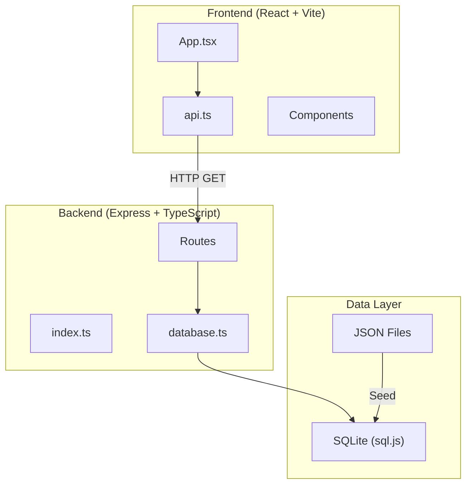
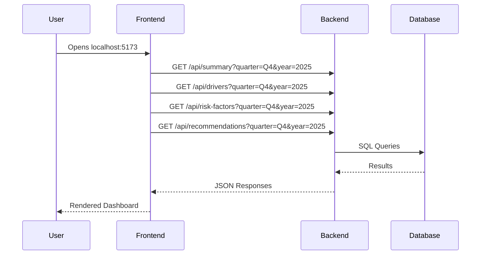
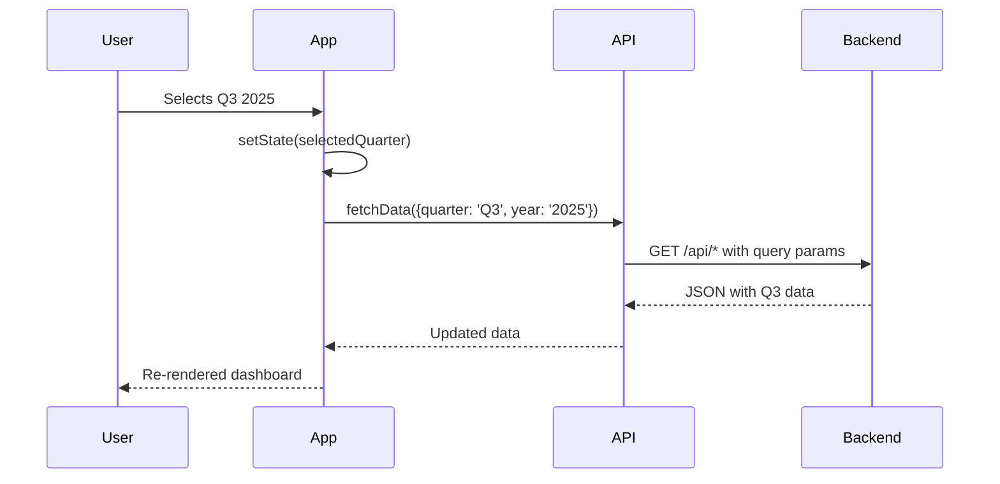

# Revenue Intelligence Console - Code Documentation

## System Architecture Overview



---

## Data Flow

### 1. Application Startup



### 2. Quarter Selection Change



---

## Backend Architecture

### Entry Point: `index.ts`

```
┌─────────────────────────────────────────────────────┐
│  Express Server (Port 3001)                         │
├─────────────────────────────────────────────────────┤
│  Middleware: CORS, JSON parsing                     │
├─────────────────────────────────────────────────────┤
│  Routes:                                            │
│    /api/summary        → summary.ts                 │
│    /api/drivers        → drivers.ts                 │
│    /api/risk-factors   → riskFactors.ts             │
│    /api/recommendations→ recommendations.ts         │
└─────────────────────────────────────────────────────┘
```

### Database Layer: `database.ts`

| Function | Purpose |
|----------|---------|
| `initDatabase()` | Initializes SQLite, creates tables if not exists |
| `getDatabase()` | Returns singleton database instance |
| `saveDatabase()` | Persists in-memory DB to file |

**Database Schema:**
```sql
accounts (account_id, name, industry, segment)
reps (rep_id, name)
deals (deal_id, account_id, rep_id, stage, amount, created_at, closed_at)
activities (activity_id, deal_id, type, timestamp)
targets (month, target)
```

---

## API Endpoints Detail

### GET `/api/summary`

**Query Parameters:** `quarter` (Q1-Q4), `year` (2024-2026)

**Response:**
```typescript
{
  currentQuarterRevenue: number,  // Sum of Closed Won deals in quarter
  target: number,                  // Sum of monthly targets
  gapPercent: number,              // (target - revenue) / target * 100
  qoqChange: number,               // Quarter-over-quarter change %
  quarterLabel: string,            // e.g., "Q4 2025"
  monthlyData: [{month, revenue, target}]
}
```

**Query Logic:**
1. Calculate quarter date range from params
2. Sum `deals.amount` WHERE `stage = 'Closed Won'` AND `closed_at` in range
3. Sum `targets.target` for months in quarter
4. Compare with previous quarter for QoQ change

---

### GET `/api/drivers`

**Query Parameters:** `quarter`, `year`

**Response:**
```typescript
{
  pipelineSize: number,      // Open deals value at quarter end
  winRate: number,           // Won / (Won + Lost) in quarter
  avgDealSize: number,       // Avg of Closed Won deals
  salesCycleTime: number,    // Avg days from created to closed
  monthlyTrend: [{month, revenue, target}]
}
```

**Query Logic:**
1. Pipeline = deals WHERE `stage IN ('Prospecting', 'Negotiation')` AND existed during quarter
2. Win Rate = deals closed in quarter
3. Cycle Time = `JULIANDAY(closed_at) - JULIANDAY(created_at)`

---

### GET `/api/risk-factors`

**Query Parameters:** `quarter`, `year`

**Response:**
```typescript
{
  staleDeals: {count, totalValue, deals[]},
  underperformingReps: [{rep_name, winRate}],
  lowActivityAccounts: [{account_name, daysSinceActivity}]
}
```

**Query Logic:**
1. Stale = open deals WHERE `days_open > 30` during quarter
2. Underperforming = reps with win rate below average in quarter
3. Low Activity = accounts with no activity in last 14 days of quarter

---

### GET `/api/recommendations`

**Query Parameters:** `quarter`, `year`

**Response:**
```typescript
{
  recommendations: [{
    priority: 'high' | 'medium' | 'low',
    title: string,
    description: string,
    metric: string
  }]
}
```

**Generation Logic:**
1. Check for aging Enterprise deals → High priority
2. Find lowest win-rate rep → Coaching recommendation
3. Identify inactive accounts → Outreach recommendation
4. Find negotiation-stage deals → Quick wins

---

## Frontend Architecture

### Component Hierarchy

```
App.tsx
├── AppBar (Header with Quarter Selector)
│   ├── Select (Quarter: Q1-Q4)
│   └── Select (Year: 2024-2026)
├── SummaryCard
│   └── Displays revenue, target, gap, QoQ change
├── RevenueDrivers
│   ├── Pipeline Value Card
│   ├── Win Rate Card
│   ├── Avg Deal Size Card
│   └── Sales Cycle Card
├── Grid
│   ├── RiskFactors
│   │   └── List of risk items with severity
│   └── Recommendations
│       └── Prioritized action items
└── RevenueTrendChart (D3.js)
    └── Bar chart with target line overlay
```

### State Management

```typescript
// App.tsx state
const [selectedQuarter, setSelectedQuarter] = useState('Q4');
const [selectedYear, setSelectedYear] = useState('2025');
const [summary, setSummary] = useState<SummaryData | null>(null);
const [drivers, setDrivers] = useState<DriversData | null>(null);
const [riskFactors, setRiskFactors] = useState<RiskFactorsData | null>(null);
const [recommendations, setRecommendations] = useState<RecommendationsData | null>(null);

// Auto-fetch on quarter change
useEffect(() => {
  fetchData({ quarter: selectedQuarter, year: selectedYear });
}, [selectedQuarter, selectedYear]);
```

### API Service (`api.ts`)

```typescript
// All endpoints accept QuarterParams
interface QuarterParams {
  quarter: string;  // 'Q1' | 'Q2' | 'Q3' | 'Q4'
  year: string;     // '2024' | '2025' | '2026'
}

// Appends as query string: ?quarter=Q4&year=2025
api.getSummary(params)
api.getDrivers(params)
api.getRiskFactors(params)
api.getRecommendations(params)
```

---

## File Structure

```
revenue-dashboard-assignment/
├── backend/
│   ├── src/
│   │   ├── index.ts           # Express server entry
│   │   ├── db/
│   │   │   ├── database.ts    # SQLite initialization
│   │   │   └── seed.ts        # Data seeding script
│   │   └── routes/
│   │       ├── summary.ts     # /api/summary
│   │       ├── drivers.ts     # /api/drivers
│   │       ├── riskFactors.ts # /api/risk-factors
│   │       └── recommendations.ts
│   └── package.json
├── frontend/
│   ├── src/
│   │   ├── App.tsx            # Main component
│   │   ├── theme.ts           # MUI theme
│   │   ├── api/
│   │   │   └── api.ts         # API service
│   │   └── components/
│   │       ├── SummaryCard.tsx
│   │       ├── RevenueDrivers.tsx
│   │       ├── RiskFactors.tsx
│   │       ├── Recommendations.tsx
│   │       └── RevenueTrendChart.tsx
│   └── package.json
├── data/                       # Source JSON files
├── THINKING.md                 # Design decisions
└── README.md                   # Setup guide
```

---

## Key Design Patterns

### 1. Quarter-Scoped Queries
All queries filter by quarter start/end dates:
```sql
WHERE closed_at >= '2025-10-01' AND closed_at <= '2025-12-31'
```

### 2. Singleton Database
Database initialized once, reused across requests:
```typescript
let db: Database | null = null;
export function getDatabase() { return db!; }
```

### 3. Parallel API Calls
Frontend fetches all endpoints simultaneously:
```typescript
const [summary, drivers, risks, recs] = await Promise.all([
  api.getSummary(params),
  api.getDrivers(params),
  api.getRiskFactors(params),
  api.getRecommendations(params)
]);
```

### 4. Reactive UI Updates
Quarter changes trigger automatic refetch:
```typescript
useEffect(() => { fetchData(...) }, [selectedQuarter, selectedYear]);
```
